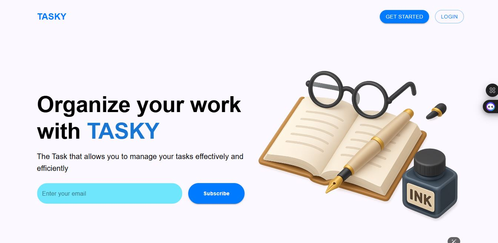

# Tasky 📝

Tasky is a sleek and responsive task management web application built with React and Material UI. It helps users manage their tasks efficiently — create, update, delete, and mark tasks as completed with ease.

## 🚀 Features

- ✅ User authentication (sign up, log in, log out)
- 📋 Create, update, delete, and view tasks
- 🎨 Clean and modern UI built with Material UI
- 🔔 Toast notifications for feedback
- 🧠 Responsive and accessible design

## 🖼️ Screenshot

| Home | 
|----------|
|  | 
## 🛠 Tech Stack

- **Frontend**: React, TypeScript, Material UI, React Router
- **State Management**: Zustand or React Context
- **Data Fetching**: Axios + React Query
- **Styling**: MUI `sx` prop and custom themes
- **Backend**: (Optional — insert backend stack if any)

## 📦 Installation

1. **Clone the repository**
   ```bash
   git clone https://github.com/your-username/tasky.git
   cd TaskY

2. **Install dependencies**
    ```bash
    npm install
    ```

3. **Run the app**
   ```bash
    npm run dev
   ```

## Made By Kedevs 😎
